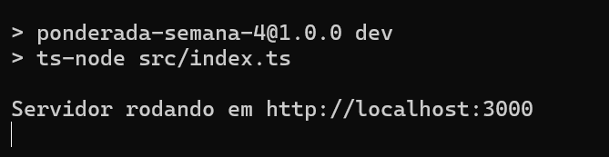

# ponderada-semana-4
Ponderada da ponderada 4 de programação - Métricas em NodeJS

- Tecnologias usadas: nodeJS e typescript 

## Criando Métrica Personalizada

* Nesse caso, criamos um histograma que monitora a duração das respostas em milissegundos

```typescript
import express from 'express';
import { Counter, Histogram, register } from 'prom-client';

const app = express();

const httpRequests = new Counter({
  name: 'http_requests_total',
  help: 'Total de requisições HTTP',
  labelNames: ['method', 'route'],
});

const responseDuration = new Histogram({
  name: 'http_response_duration_seconds',
  help: 'Duração das respostas HTTP em segundos',
  labelNames: ['method', 'route'],
  buckets: [0.1, 0.5, 1, 2, 5]  
});

app.use((req, res, next) => {
  httpRequests.inc({ method: req.method, route: req.path });
  
  const end = responseDuration.startTimer({ method: req.method, route: req.path });
  res.on('finish', () => {
    end();
  });

  next();
});

app.get('/example', (req, res) => {
  res.send("Métrica personalizada registrada!");
});

app.get('/metrics', async (req, res) => {
  res.set('Content-Type', register.contentType);
  res.end(await register.metrics());
});

app.listen(3000, () => {
  console.log('Servidor rodando em http://localhost:3000');
});

```



## Exibir a nova métrica

* Agora, iremos acessar o endpoint /example algumas vezes para gravar os dados e depois iremos no /metrics para visualizá-los. Aqui está:   


## Obtenha um Medidor por meio da injeção de dependência

* Agora, iremos configurar uma classe que injeta a métrica, nesse caso, o **metricsService.ts**

```typescript
import { Counter, Histogram } from 'prom-client';

export class MetricsService {
  public httpRequests: Counter<string>;
  public responseDuration: Histogram<string>;

  constructor() {
    this.httpRequests = new Counter({
      name: 'http_requests_total',
      help: 'Total de requisições HTTP',
      labelNames: ['method', 'route'],
    });

    this.responseDuration = new Histogram({
      name: 'http_response_duration_seconds',
      help: 'Duração das respostas HTTP em segundos',
      labelNames: ['method', 'route'],
      buckets: [0.1, 0.5, 1, 2, 5],
    });
  }
}

```
* Depois disso, vamos alterar o **index.ts** para se adaptar à classe metricsService:

```typescript
import express from 'express';
import { register } from 'prom-client';
import { MetricsService } from './MetricsService';

const app = express();
const metricsService = new MetricsService();

app.use((req, res, next) => {
  metricsService.httpRequests.inc({ method: req.method, route: req.path });

  const end = metricsService.responseDuration.startTimer({ method: req.method, route: req.path });
  res.on('finish', () => {
    end();
  });

  next();
});

// Rota de exemplo
app.get('/example', (req, res) => {
  res.send("Métrica com injeção de dependência registrada!");
});

// Endpoint para expor as métricas
app.get('/metrics', async (req, res) => {
  res.set('Content-Type', register.contentType);
  res.end(await register.metrics());
});

app.listen(3000, () => {
  console.log('Servidor rodando em http://localhost:3000');
});

```


## Exemplo de diferentes tipos de instrumento

* Vamos adicionar o Gauge agora para capturar os usuários ativos 

```typescript
import { Counter, Gauge, Histogram } from 'prom-client';

export class MetricsService {
  public httpRequests: Counter<string>;
  public responseDuration: Histogram<string>;
  public activeUsers: Gauge<string>;


  constructor() {
    this.httpRequests = new Counter({
      name: 'http_requests_total',
      help: 'Total de requisições HTTP',
      labelNames: ['method', 'route'],
    });

    this.responseDuration = new Histogram({
      name: 'http_response_duration_seconds',
      help: 'Duração das respostas HTTP em segundos',
      labelNames: ['method', 'route'],
      buckets: [0.1, 0.5, 1, 2, 5],
    });

    this.activeUsers = new Gauge({
        name: 'active_users',
        help: 'Número de usuários ativos no momento',
      });
  }
}
```
* e também executaremos isso na estrutura da API

```typescript 

import express from 'express';
import { register } from 'prom-client';
import { MetricsService } from './metricsService';

const app = express();
const metricsService = new MetricsService();

app.use((req, res, next) => {
  metricsService.httpRequests.inc({ method: req.method, route: req.path });

  const end = metricsService.responseDuration.startTimer({ method: req.method, route: req.path });
  res.on('finish', () => {
    end();
  });

  next();
});

app.post('/user/login', (req, res) => {
  metricsService.activeUsers.inc();
  res.send("Usuário logado!");
});

app.get('/example', (req, res) => {
  res.send("Métrica com injeção de dependência registrada!");
});

app.get('/metrics', async (req, res) => {
  res.set('Content-Type', register.contentType);
  res.end(await register.metrics());
});

app.listen(3000, () => {
  console.log('Servidor rodando em http://localhost:3000');
});

```

## Métricas multidimensionais

* Vamos adicionar métricas que utilizam múltiplos rótulos (labels) para registrar mais informações sobre cada evento
* vamos usar **status_code**, **method** e **route** no httpCounter

```typescript
    import { Counter, Gauge, Histogram } from 'prom-client';

    export class MetricsService {
    public httpRequests: Counter<string>;
    public responseDuration: Histogram<string>;
    public activeUsers: Gauge<string>;


    constructor() {
        this.httpRequests = new Counter({
        name: 'http_requests_total',
        help: 'Total de requisições HTTP',
        labelNames: ['method', 'route', 'status_code'],
        });

        this.responseDuration = new Histogram({
        name: 'http_response_duration_seconds',
        help: 'Duração das respostas HTTP em segundos',
        labelNames: ['method', 'route'],
        buckets: [0.1, 0.5, 1, 2, 5],
        });

        this.activeUsers = new Gauge({
            name: 'active_users',
            help: 'Número de usuários ativos no momento',
        });
    }
    }

```

* Agora vamos adicionar isso no middleware

```typescript
import express from 'express';
import { register } from 'prom-client';
import { MetricsService } from './metricsService';

const app = express();
const metricsService = new MetricsService();

app.use((req, res, next) => {
  metricsService.httpRequests.inc({ 
    method: req.method, 
    route: req.path,
    status_code: res.statusCode.toString() 
  });

  const end = metricsService.responseDuration.startTimer({ method: req.method, route: req.path });
  res.on('finish', () => {
    end();
  });

  next();
});

app.post('/user/login', (req, res) => {
  metricsService.activeUsers.inc();
  res.send("Usuário logado!");
});

app.get('/example', (req, res) => {
  res.send("Métrica com injeção de dependência registrada!");
});

app.get('/metrics', async (req, res) => {
  res.set('Content-Type', register.contentType);
  res.end(await register.metrics());
});

app.listen(3000, () => {
  console.log('Servidor rodando em http://localhost:3000');
});


```

## Testar com a injeção de dependência

* O formato do código com injeção de dependência ficaria assim: 

```typescript
import express from 'express';
import { register } from 'prom-client';
import { MetricsService } from './metricsService';

const app = express();
const metricsService = new MetricsService();

app.use((req, res, next) => {
  metricsService.httpRequests.inc({ 
    method: req.method, 
    route: req.path,
    status_code: res.statusCode.toString() 
  });

  const end = metricsService.responseDuration.startTimer({ method: req.method, route: req.path });
  res.on('finish', () => {
    end();
  });

  next();
});

app.get('/example', (req, res) => {
  res.send("Métrica com injeção de dependência registrada!");
});

app.get('/metrics', async (req, res) => {
  res.set('Content-Type', register.contentType);
  res.end(await register.metrics());
});

app.listen(3000, () => {
  console.log('Servidor rodando em http://localhost:3000');
});

```

## Testar sem a injeção de dependência

* Agora, o teste sem a injeção de dependência

```typescript
import express from 'express';
import { Counter, register, Histogram } from 'prom-client';

const app = express();

// Criando métricas diretamente
const httpRequests = new Counter({
  name: 'http_requests_total',
  help: 'Total de requisições HTTP',
  labelNames: ['method', 'route', 'status_code'],
});

const responseDuration = new Histogram({
  name: 'http_duration_seconds',
  help: 'Duração das requisições HTTP em segundos',
  labelNames: ['method', 'route'],
});

app.use((req, res, next) => {
  httpRequests.inc({ 
    method: req.method, 
    route: req.path,
    status_code: res.statusCode.toString() 
  });

  const end = responseDuration.startTimer({ method: req.method, route: req.path });
  res.on('finish', () => {
    end();
  });

  next();
});

app.get('/example', (req, res) => {
  res.send("Métrica sem injeção de dependência registrada!");
});

app.get('/metrics', async (req, res) => {
  res.set('Content-Type', register.contentType);
  res.end(await register.metrics());
});

app.listen(3000, () => {
  console.log('Servidor rodando em http://localhost:3000');
});

```